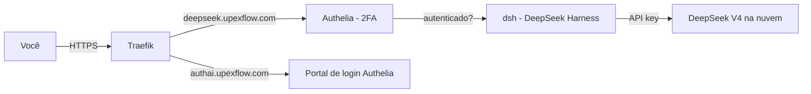

# UpexFlow — ai-hub

Infraestrutura do **DeepSeek Harness (dsh)** na VPS Hostinger, com porta de login
(Authelia) e autenticação de dois fatores (2FA).

> Repositório **privado**. As configs reais com segredos **não** estão aqui —
> apenas versões `.example` com placeholders (ver `.gitignore`).

## Componentes

| Pasta | O que é |
|---|---|
| `dsh/` | Dockerfile do DeepSeek Harness (com proxy TCP interno) |
| `authelia/` | Config do portão de login (`.example`, sem segredos) |
| `traefik/` | Rotas do Traefik (domínios + forward-auth) |
| `scripts/` | Scripts de setup/histórico da montagem |
| `docs/` | Guia de deploy e operação |

## Arquitetura

- **Casca** (interface + execução + arquivos): roda na VPS.
- **Cérebro** (modelo): API DeepSeek na nuvem (a VPS só orquestra).

## URLs

| URL | Função |
|---|---|
| `https://deepseek.upexflow.com` | O app (DeepSeek Harness) — exige login + 2FA |
| `https://authai.upexflow.com` | Tela de login / reset de senha |

## Deploy

Veja [`docs/DEPLOY.md`](docs/DEPLOY.md) para o passo a passo completo.

## Segurança

- Segredos reais ficam em `/root/.secrets/` e `/root/authelia/config/` na VPS (fora do Git).
- Antes de reutilizar qualquer config `.example`, gere os segredos com `openssl rand -hex 32`
  e o hash de senha com `authelia crypto hash generate argon2 --random`.
